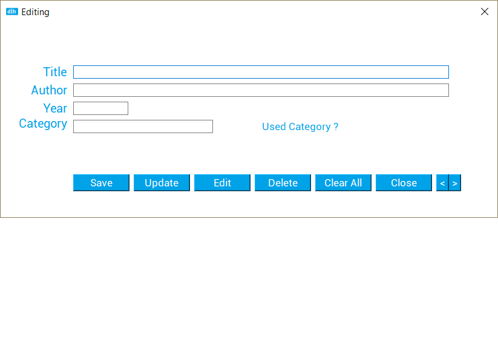

# DoIHave - Database Management

DoIHave was made for those who, just like me, can't remember all the books or CD's that they have. This can be a huge hassle if 
you want to buy more but you're not sure if you already have it (yes, that happens!!).

With it's very simple and intuitive interface, DoIHave allows the user to easily manage all these items. You just have to insert all the things that you want, with their respective category, and then you can just search for it. 

This app allows you to: 
  - Insert Item 
  - Modify Item
  - Delete Item
  - Search Item
  - View all the Items

DoIHave is a work in progress, the database still has a couple flaws and it is still a desktop app. Hopefully in the future
there will be a DoIHave mobile application.
